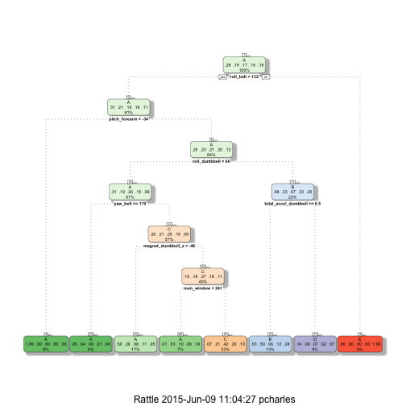

# Practical Machine Learning - Activity Type Analysis


## Summary

This project uses human activity sensor data 
to test the predictive capabilities of various machine learning
algorithms.

In particular, trees and random forests are used to build predictive models
using training data sets. Those models are then applied to test data sets
to see how effective they are at determining activity quality as an outcome.

More information about the data set can be found at:
[Human Activity Recognition](http://groupware.les.inf.puc-rio.br/har)


## Prerequisites

The caret machine learning package is used for machine learning,
along with the rpart package for tree models. ggplot2 and rattle are
used for visualization.

```r
  if(!require(caret)) install.packages("caret", dep=T)
  if(!require(rpart)) install.packages("rpart", dep=T)
  if(!require(rattle)) install.packages("rattle", dep=T)
  if(!require(ggplot2)) install.packages("ggplot2", dep=T)
```


## Data


```r
  missingValues = c("NA","#DIV/0!", "") # recode missing values as type NA
  download.file(url="https://d396qusza40orc.cloudfront.net/predmachlearn/pml-training.csv", destfile="data/pml-training.csv", method="curl")
  pml.train.in <- read.csv("data/pml-training.csv", na.strings=missingValues)
```


```r
  download.file(url="https://d396qusza40orc.cloudfront.net/predmachlearn/pml-testing.csv", destfile="data/pml-testing.csv", method="curl")
  pml.test.final <- read.csv("data/pml-testing.csv", na.strings=missingValues)
```


## Transformation

Columns which aren't relevant to the activity type, or contain NA values,
are removed from the training data set.


```r
  set.seed(2482)
  # remove columns containing only NA data
  removeTrain <- colSums(is.na(pml.train.in)) < nrow(pml.train.in)
  pml.train.clean <- pml.train.in[,removeTrain]
  removeTest <- colSums(is.na(pml.test.final)) < nrow(pml.test.final)
  pml.train.clean <- pml.train.in[,removeTest]
  # remove time stamps and other non-activity data
  pml.train.clean <- pml.train.clean[,-(1:5)]
```

The following variables remain after filtering out NA columns and
non-activity data.

```r
  names(pml.train.clean)
```

```
##  [1] "new_window"           "num_window"           "roll_belt"           
##  [4] "pitch_belt"           "yaw_belt"             "total_accel_belt"    
##  [7] "gyros_belt_x"         "gyros_belt_y"         "gyros_belt_z"        
## [10] "accel_belt_x"         "accel_belt_y"         "accel_belt_z"        
## [13] "magnet_belt_x"        "magnet_belt_y"        "magnet_belt_z"       
## [16] "roll_arm"             "pitch_arm"            "yaw_arm"             
## [19] "total_accel_arm"      "gyros_arm_x"          "gyros_arm_y"         
## [22] "gyros_arm_z"          "accel_arm_x"          "accel_arm_y"         
## [25] "accel_arm_z"          "magnet_arm_x"         "magnet_arm_y"        
## [28] "magnet_arm_z"         "roll_dumbbell"        "pitch_dumbbell"      
## [31] "yaw_dumbbell"         "total_accel_dumbbell" "gyros_dumbbell_x"    
## [34] "gyros_dumbbell_y"     "gyros_dumbbell_z"     "accel_dumbbell_x"    
## [37] "accel_dumbbell_y"     "accel_dumbbell_z"     "magnet_dumbbell_x"   
## [40] "magnet_dumbbell_y"    "magnet_dumbbell_z"    "roll_forearm"        
## [43] "pitch_forearm"        "yaw_forearm"          "total_accel_forearm" 
## [46] "gyros_forearm_x"      "gyros_forearm_y"      "gyros_forearm_z"     
## [49] "accel_forearm_x"      "accel_forearm_y"      "accel_forearm_z"     
## [52] "magnet_forearm_x"     "magnet_forearm_y"     "magnet_forearm_z"    
## [55] "classe"
```

'classe' (a measure of the quality of the activity) is the outcome
being predicted.


## Data Partitioning

The provided 'test' data set is further broken into two sets,
for training and model testing purposes, while the provided
final test data is set aside.


```r
  # separate training set into training and test subsets
  inTrain <-
    createDataPartition(y=pml.train.clean$classe, p=0.1, list=FALSE)
  pml.train <- pml.train.clean[inTrain, ]
  pml.test <- pml.train.clean[-inTrain, ]
```

The dimensions of the data sets after partitioning:

```r
  # The dimensions of the sets:
  dim(pml.train) # training
```

```
## [1] 1964   55
```

```r
  dim(pml.test) # testing
```

```
## [1] 17658    55
```

```r
  dim(pml.test.final) # 'hidden' or final test set
```

```
## [1]  20 160
```


## Exploratory Analysis

Some visualization of the data is performed to see the complexity of
the data and the relationship between some selected variables
(e.g. the pitch and yaw of the subject's forearm), compared to the
activity class outcome groupings.


```r
  ggplot(pml.train) + aes(x=pitch_forearm, y=yaw_forearm, color=classe) +
    xlab("Forearm Pitch") + ylab("Forearm Yaw") +
    geom_point(shape=19, size=2, alpha=0.3, aes(color=classe)) +
    ggtitle("Forearm Pitch and Yaw vs. Outcome")
```

 


## Machine Learning/Prediction - Tree Model

A tree model of type 'rpart' (recursive partitioning and regression tree)
is built using activity quality 'classe' as an outcome and all other
variables as predictors.

### Training


```r
  pml.tree <- train(classe ~ ., method="rpart", data=pml.train)
```

### Classification/Visualization

The structure of the classification tree and criteria can be visualized:

```r
  fancyRpartPlot(pml.tree$finalModel)
```

 

### Tree Model Accuracy / Predictions

The tree prediction model contains a summary of parameters and estimates of
accuracy.


```r
  pml.tree
```

```
## CART 
## 
## 1964 samples
##   54 predictor
##    5 classes: 'A', 'B', 'C', 'D', 'E' 
## 
## No pre-processing
## Resampling: Bootstrapped (25 reps) 
## 
## Summary of sample sizes: 1964, 1964, 1964, 1964, 1964, 1964, ... 
## 
## Resampling results across tuning parameters:
## 
##   cp          Accuracy   Kappa       Accuracy SD  Kappa SD  
##   0.03698435  0.5549200  0.43396300  0.03249661   0.04277309
##   0.03947368  0.5477336  0.42445049  0.02824959   0.03788272
##   0.12091038  0.3296200  0.07413283  0.04454737   0.06225282
## 
## Accuracy was used to select the optimal model using  the largest value.
## The final value used for the model was cp = 0.03698435.
```

The estimated accuracy is **55.49%**

Let's see how that compares to actual accuracy on the training and test
sets. Activity quality outcomes can be predicted using the tree model and
compared with the actual classe variables in the training and test sets.


```r
  # percentage accuracy 
  perc = function(predicted, actual) {
    sum(predicted == actual) / length(actual) * 100
  }
  t.train.acc <- perc(predict(pml.tree, newdata=pml.train), pml.train$classe)
  t.test.acc <- perc(predict(pml.tree, newdata=pml.test), pml.test$classe)
```

Applying the tree model predictions on the training and test data sets,
and comparing the results with the actual activity quality outcome, yields:
* training set prediction accuracy: **56.01%**
* test set prediction accuracy: **56.60%**

As expected, applying the tree model to a new test set results in a
lower accuracy than what was achieved on the training set.

**57%** accuracy isn't much better than chance, 
so let's try a more sophisticated model.


## Machine Learning/Prediction - Random Forest

### Model

Random forests use bootstrapping and many multiple tree generations to find an
optimal solution.


```r
  pml.rf <- train(classe ~., data = pml.train, method = "rf");
  pml.rf
```

```
## Random Forest 
## 
## 1964 samples
##   54 predictor
##    5 classes: 'A', 'B', 'C', 'D', 'E' 
## 
## No pre-processing
## Resampling: Bootstrapped (25 reps) 
## 
## Summary of sample sizes: 1964, 1964, 1964, 1964, 1964, 1964, ... 
## 
## Resampling results across tuning parameters:
## 
##   mtry  Accuracy   Kappa      Accuracy SD  Kappa SD   
##    2    0.9374497  0.9207976  0.007804037  0.009795485
##   28    0.9502185  0.9369868  0.008192579  0.010330957
##   54    0.9459012  0.9315341  0.009279407  0.011612844
## 
## Accuracy was used to select the optimal model using  the largest value.
## The final value used for the model was mtry = 28.
```

### Random Forest Accuracy / Predictions

Estimated accuracy is **95.02%**


```r
  rf.train.acc <- perc(predict(pml.rf, newdata=pml.train), pml.train$classe)
```

```
## Loading required package: randomForest
## randomForest 4.6-10
## Type rfNews() to see new features/changes/bug fixes.
```

```r
  rf.test.acc <- perc(predict(pml.rf, newdata=pml.test), pml.test$classe)
```

Applying the random forest predictions on the training and test data sets
and comparing the results with the actual activity quality outcomes yields:
* training set prediction accuracy: **97.05%**
* testing set prediction accuracy: **96.92%**

### Out of Sample Error and Cross Validation

Summary statistics for performance of the model on the test data
set, which was not used in the training of the random forest,
gives us an estimate of the sample error and a confidence interval.


```r
  pml.rf.test.predictions <- predict(pml.rf, pml.test)
  rfcm <- confusionMatrix(pml.test$classe, pml.rf.test.predictions)
  rfcm
```

```
## Confusion Matrix and Statistics
## 
##           Reference
## Prediction    A    B    C    D    E
##          A 5002   16    0    4    0
##          B   88 3222   92   12    3
##          C    0   65 2993   21    0
##          D    7    4  129 2732   22
##          E    0   34   15   32 3165
## 
## Overall Statistics
##                                           
##                Accuracy : 0.9692          
##                  95% CI : (0.9665, 0.9717)
##     No Information Rate : 0.2887          
##     P-Value [Acc > NIR] : < 2.2e-16       
##                                           
##                   Kappa : 0.961           
##  Mcnemar's Test P-Value : NA              
## 
## Statistics by Class:
## 
##                      Class: A Class: B Class: C Class: D Class: E
## Sensitivity            0.9814   0.9644   0.9269   0.9754   0.9922
## Specificity            0.9984   0.9864   0.9940   0.9891   0.9944
## Pos Pred Value         0.9960   0.9429   0.9721   0.9440   0.9750
## Neg Pred Value         0.9925   0.9916   0.9838   0.9953   0.9983
## Prevalence             0.2887   0.1892   0.1829   0.1586   0.1807
## Detection Rate         0.2833   0.1825   0.1695   0.1547   0.1792
## Detection Prevalence   0.2844   0.1935   0.1744   0.1639   0.1838
## Balanced Accuracy      0.9899   0.9754   0.9605   0.9822   0.9933
```


```r
  pml.rf$finalModel
```

```
## 
## Call:
##  randomForest(x = x, y = y, mtry = param$mtry) 
##                Type of random forest: classification
##                      Number of trees: 500
## No. of variables tried at each split: 28
## 
##         OOB estimate of  error rate: 3.41%
## Confusion matrix:
##     A   B   C   D   E class.error
## A 556   1   1   0   0 0.003584229
## B  16 351   7   2   4 0.076315789
## C   0  15 325   2   1 0.052478134
## D   1   3   5 313   0 0.027950311
## E   0   2   1   6 352 0.024930748
```

* The estimated accuracy of the random forest prediction model is
**96.92%**.

* The 95% confidence interval is **96.65%** to **97.17%**

* The estimated out of sample error rate is **~3.41%**


## Conclusion

Two machine learning algorithms were applied to predict activity 
quality outcomes from human activity sensor data.

Data was partitioned into training and test data sets and 
two algorithms, trees and random forest, compared in their 
efficacy for prediction of activity quality.

* The tree model achieved **56.60%** accuracy
* The random forest model achieved **96.92%** accuracy.


